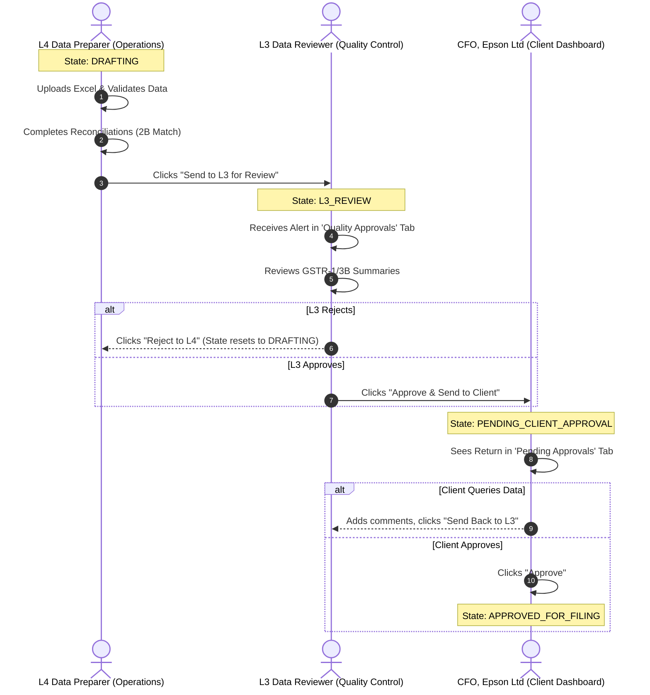
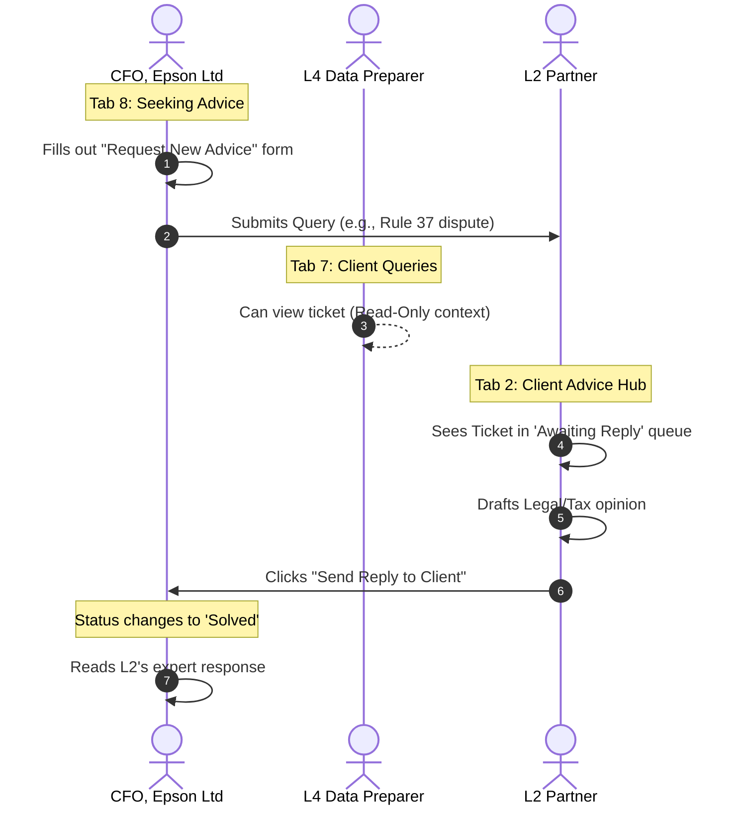
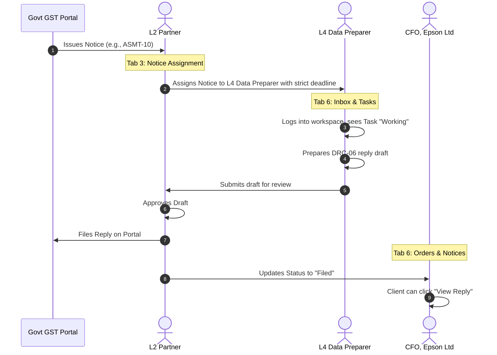

# Accolet IndiaGST: Tripartite Relational Architecture

This document maps the data flow, state management, and operational workflows between the four core portals of the Accolet ecosystem:
1. **Client Dashboard** (`kpi_dashboard.html`)
2. **L4 Operations Portal** (`ca_dashboard.html`)
3. **L3 Review Center** (`l3_dashboard.html`)
4. **L2 Partner Command Center** (`partner_dashboard.html`)

Developers should use this document to design the backend database relations, API routing, and role-based access control (RBAC).

---

## 1. Core Compliance Workflow (GSTR-1 & GSTR-3B)

This is the primary pipeline for monthly return filing. Data originates from the L4 CA workspace, moves up to the L3 Data Reviewer for quality control, and is finally pushed to the Client for final sign-off.

---

## 2. Client Advice Hub (Ticketing System)

The "Seeking Advice" feature is a built-in support module. While the L4/L3 team handles routine work, complex tax queries are routed directly to the L2 Partner for expert legal opinions. The L2 Partner retains overarching visibility into the health of all clients.

---

## 3. Litigation & Notice Management

Notices issued by the GST Department follow a top-down assignment flow, ensuring the Partner maintains firm-wide oversight over legal risks.

---

## 4. Database State Machine Relations

For the backend developer, entities like `GST_Returns` and `Advice_Tickets` must follow strict state transitions governed by the RBAC matrix.

### `GST_Returns` (GSTR-1, 3B, 6, 9)
*   `DRAFT` (Owned by L4 CA)
*   `L3_REVIEW` (Owned by L3 Data Reviewer; L4 is locked out)
*   `CLIENT_APPROVAL` (Owned by Client; Visible in Tab 5 of Client Dashboard)
*   `APPROVED_FOR_FILING` (Passed back to L4/L3 for API transmission to GSTN)
*   `FILED` (Terminal state; Triggers ARN generation in Client Tab 7)

### `Advice_Tickets`
*   `OPEN` (Created by Client)
*   `PARTNER_DRAFTING` (Partner is writing response)
*   `CLOSED_SOLVED` (Response sent to Client)

### `Notice_Lifecycle`
*   `UNASSIGNED` (Visible only to Partner)
*   `WORKING` (Assigned to CA; Visible to Client as "Working")
*   `PENDING_PARTNER` (CA submitted draft to Partner)
*   `FILED` (Reply submitted to Govt)
*   `UNDER_APPEAL` (Elevated legal status)
